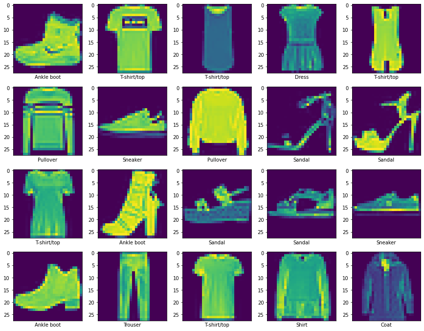

# Clothing classification
Using neural networks for Fashion-MNIST

Fashion-MNIST is a dataset of images of clothing items, such as shirts, pants, and shoes, that is often used as a replacement for the commonly used MNIST dataset in machine learning and computer vision tasks. It consists of 60,000 training images and 10,000 test images, each 28x28 pixels in size and labeled with one of 10 different clothing item types.

